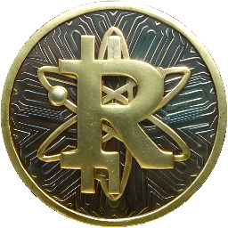

# Ruthenium
[](https://github.com/my-cloud/ruthenium/releases)
[](https://github.com/my-cloud/ruthenium/actions?query=workflow%3ABuild+event%3Apush+branch%3Amain)

<div style="text-align: center">

</div>


## Description
[](https://github.com/my-cloud/ruthenium/wiki)
[](https://github.com/my-cloud/ruthenium/wiki/Whitepaper)

Golang implementation of the Ruthenium protocol.

You will find a detailed description of the project in the [wiki](https://github.com/my-cloud/ruthenium/wiki/Home). To understand the motivations behind the creation of this blockchain, you can peruse the comprehensive details outlined in the Ruthenium [whitepaper](https://github.com/my-cloud/ruthenium/wiki/Whitepaper). 

## Quickstart
There are two ways to run a Ruthenium node. You can either use your own build from [sources](https://github.com/my-cloud/ruthenium/releases) (Option A) or use a docker image provided in the [repository packages](https://github.com/my-cloud/ruthenium/pkgs/container/ruthenium) (Option B).

### Prerequisites
* Option A (using sources):
  * You need to have [](https://go.dev/dl/) installed.
  * If you are using Windows, you need to have [tdm-gcc](https://jmeubank.github.io/tdm-gcc/) installed.
* Option B (using docker image):
  * You need to have [](https://www.docker.com/) installed.
* Your firewall port 10600 must be open (please read "Program arguments" section of the [node](src/node/README.md#program-arguments) and [UI server](src/ui/README.md#program-arguments) documentation if you want to use another port than 10600).
* To get an income or validate blocks ou need to be registered in the [Proof of Humanity](https://github.com/my-cloud/ruthenium/wiki/Whitepaper#proof-of-humanity) registry.

### Installation
* Option A (using sources):
  * Download the sources archive:
    ```
    https://github.com/my-cloud/ruthenium/releases/latest
    ```
* Option B (using docker image):
  * Pull the image:
    ```
    sudo docker pull ghcr.io/my-cloud/ruthenium:latest
    ```

### Launch
* Option A (using sources):
  * Extract files from the sources archive
  * At root level (ruthenium folder), run the [node](src/node/README.md):
    ```
    go run src/node/main.go -private-key=<private key>
    ```
  * At root level (ruthenium folder), run the [UI server](src/ui/README.md):
    ```
    go run src/ui/main.go -host-ip=<your external IP address>
    ```
* Option B (using docker image):
  * Run the [node](src/node/README.md):
    ```
    sudo docker run -p 10600:10600 -ti ghcr.io/my-cloud/ruthenium:latest \app\node -private-key=<private key>
    ```
  * Run the [UI server](src/ui/README.md):
    ```
    sudo docker run -p 8080:8080 -ti ghcr.io/my-cloud/ruthenium:latest \app\ui -host-ip=<your external IP address>
    ```
* Using a web browser, go to:
  * http://localhost:8080

## APIs
* [host node API](src/node/README.md#api)
* [UI server API](src/ui/README.md#api)

## Contributing
[](https://github.com/my-cloud/ruthenium/fork)
[](https://github.com/my-cloud/ruthenium)

Contributions are what make the open source community such an amazing place to learn, inspire, and create. Any contributions you make are greatly appreciated.

If you have a suggestion that would make this better, please do not hesitate to [report a new bug](https://github.com/my-cloud/ruthenium/issues/new?assignees=&labels=bug&template=bug_report.md&title=) or [request a new feature](https://github.com/my-cloud/ruthenium/issues/new?assignees=&labels=enhancement&template=feature_request.md&title=). Of course, you are welcome to fork the repository and create a pull request. In any case, please let's take a look at the [contributing](.github/CONTRIBUTING.md) file.

⭐ Don't forget to give the project a [star](https://docs.github.com/en/get-started/exploring-projects-on-github/saving-repositories-with-stars)! Thanks again!

## Contact
Founder: [Jérémy Pansier](https://github.com/JeremyPansier) - jpansier@my-cloud.me

Repository: https://github.com/my-cloud/ruthenium

## Authors and Acknowledgments
[](https://github.com/my-cloud/ruthenium/graphs/contributors)

Special thanks to [Gwenall Pansier](https://github.com/Gwenall) who contributed since the early developments.

For a [tutorial to create a first blockchain in Go][1], thanks to [Yuko Sakai][2] & [Jun Sakai][3].

## License
[](LICENSE)


## Project status
[](https://github.com/my-cloud/ruthenium/commits/main)

[](https://sonarcloud.io/component_measures?id=my-cloud_ruthenium&metric=sqale_rating)
[](https://sonarcloud.io/component_measures?id=my-cloud_ruthenium&metric=security_rating)
[](https://sonarcloud.io/component_measures?id=my-cloud_ruthenium&metric=reliability_rating)
[](https://sonarcloud.io/component_measures?id=my-cloud_ruthenium&metric=coverage)

While the main principles have been implemented, there is still a substantial amount of refactoring and test implementation remaining.

[1]: https://www.udemy.com/course/golang-how-to-build-a-blockchain-in-go/ "Udemy tutorial to build a blockchain in Go"
[2]: https://www.udemy.com/user/myeigoworld/ "Yuko Sakai LinkedIn profile"
[3]: https://udemy.com/user/jun-sakai/ "Jun Sakai LinkedIn profile"
